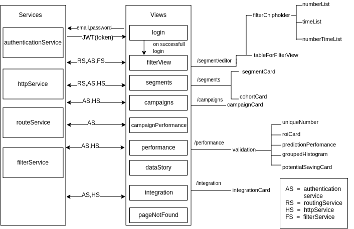

# Frontend

This project was generated with [Angular CLI](https://github.com/angular/angular-cli) version 1.4.8.

## Development server

Run `ng serve` for a dev server. Navigate to `http://localhost:4200/`. The app will automatically reload if you change any of the source files.

## Code scaffolding

Run `ng generate component component-name` to generate a new component. You can also use `ng generate directive|pipe|service|class|guard|interface|enum|module`.

## Build

Run `ng build` to build the project. The build artifacts will be stored in the `dist/` directory. Use the `-prod` flag for a production build.

## Running unit tests

Run `ng test` to execute the unit tests via [Karma](https://karma-runner.github.io).

## Running end-to-end tests

Run `ng e2e` to execute the end-to-end tests via [Protractor](http://www.protractortest.org/).

## Further help

To get more help on the Angular CLI use `ng help` or go check out the [Angular CLI README](https://github.com/angular/angular-cli/blob/master/README.md).

## Architecture



## Environments and Deployment
Configuration for the app are retrieved based on the environments.
Currently we have three environments
1. prod
2. demo
3. dev  --> (default)
TS files for them can be found at 'src/environments/'
Configuration for these environments are in '.angular-cli.json' file under 'environments' property

Build(eg):
ng build --environment=demo
ng build --environment=prod

Serve(eg):
ng serve --environment=demo
ng serve --environment=prod

ng serve/build with no environment flag assumes 'dev' environment by default

## Folder Structure 
```
dashboard
|
|-- e2e                         # End-to-end tests
|-- node.module                 # ALl third party modules listed in package.json 
|-- src                         # Source files (Angular components, templates, styles, images)
    |-- app                     # Defines the AppComponent(HTML, CSS, test file)
        |-- components          # Components which structure the application
        |-- guards              # Authentication service
        |-- services            # Substitutable objects to organize and share code across the application.
        |-- views               # Angular supports Single Page Application via multiple views on a single page.
            |-- datastory       # EDA report
            |-- feed            # Feed cards 
            |-- login           # Login page for the users to access feed cards, validation view and segment-editor
            |-- page-not-found  # 404 error page
            |-- segment-editor  # Segment view
            |-- validation      # Validation view
        |-- app.module.ts       # Root module that tells Angular how to assemble the application. 
    |-- assets                  # Images and pdf files
    |-- environments            # Configuration variables
|-- [CHANGELOG.md][CHANGELOG.md]
|-- [CONTRIBUTING.md][CONTRIBUTING.md]     
|-- [README.md][README.md]   
```

[CHANGELOG.md]: CHANGELOG.md
[CONTRIBUTING.md]: CONTRIBUTING.md  
[README.md]: README.md


